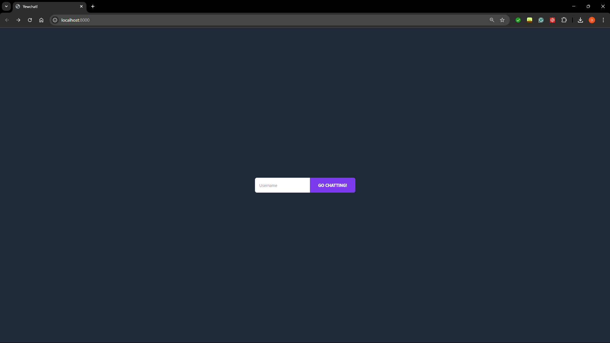
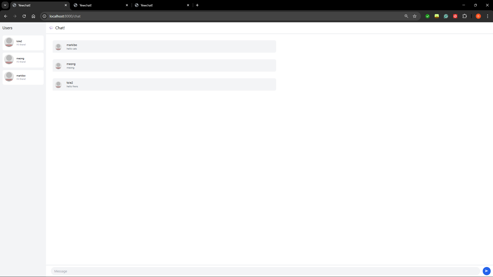
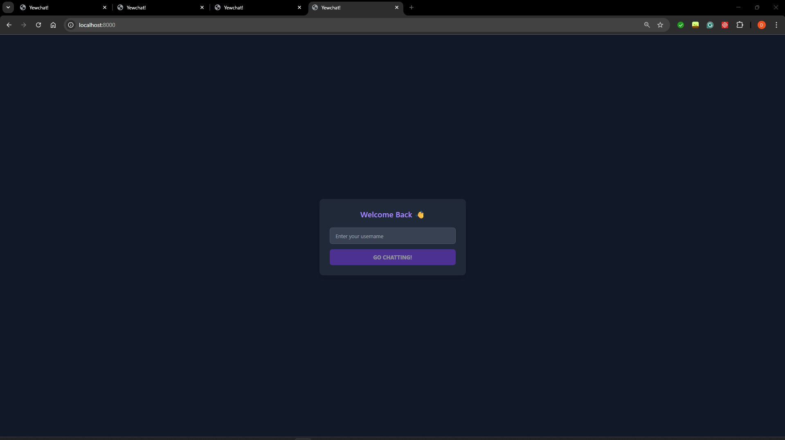
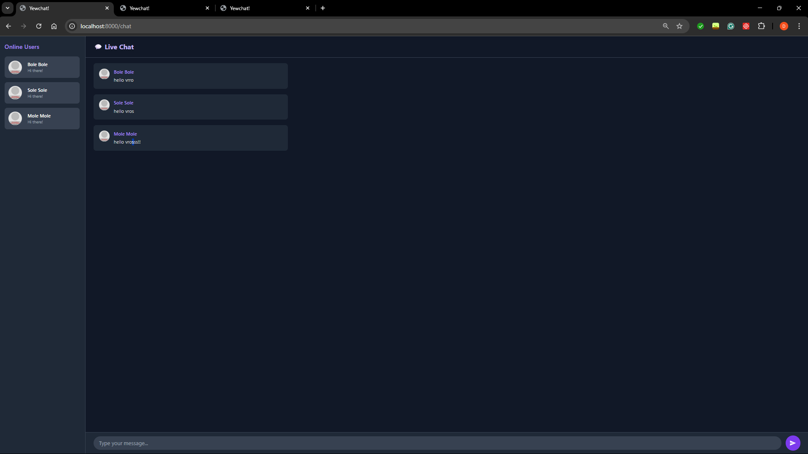

## 3.1

## 3.2

For this experiment I just implemented a dark theme and reformated the page to have a dark theme and be more intuitive by design. I applied dark colors like black to obtain this theme and I made text white to match with it. For the login page I moved the button to be lower so that it is under the input field which makes it look cleaner and use up alot of the space around it. For the chatroom I made it primarily dark but kept the core function the same such that I did not infringe on the core processes. Other than that I just added some reactive buttons. I chose this because I feel like people can spend hours in a chat room and lose track of time. For the sake of their eyes and their continued chatting a darker theme would be better for a person who maybe hooked on a coversation. While it may look hostile to some people I feel like people who frequently stay on chat rooms will appreciate the change.